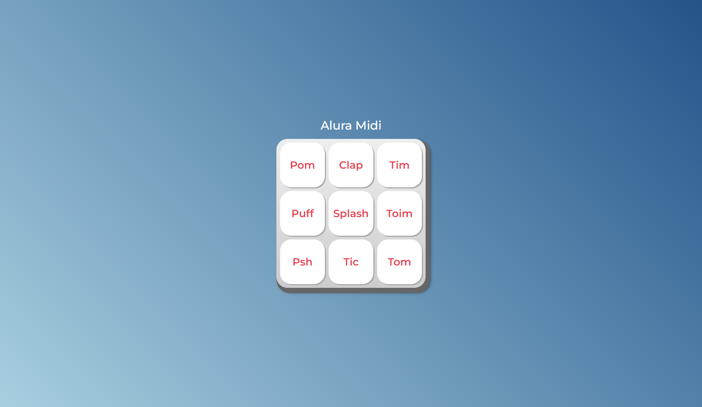

<h1 align="center"> AluraMidi </h1>

    Projeto desenvolvido no curso JavaScript para Web: Crie páginas dinâmicas.

  <a href="#-tecnologias">Tecnologias</a>&nbsp;&nbsp;&nbsp;|&nbsp;&nbsp;&nbsp;
  <a href="#-projeto">Projeto</a>&nbsp;&nbsp;&nbsp;|&nbsp;&nbsp;&nbsp;
 <a href="#memo-licença">Licença</a>

  

 

   #vitrinedev

## 🚀 Tecnologias

Esse projeto foi desenvolvido com as seguintes tecnologias:

- HTML e CSS
- JavaScript e (DOM)
- Git e Github

## 💻 Projeto

Associar o JavaScript com HTML através do DOM.
Implementar funções com JavaScript.
Investigar possibilidades de resolução de problemas de código.
Selecionar operadores lógicos adequados para diferentes situações.
Produzir soluções simples para páginas dinâmicas.

## :memo: Licença

Esse projeto está sob a licença MIT.